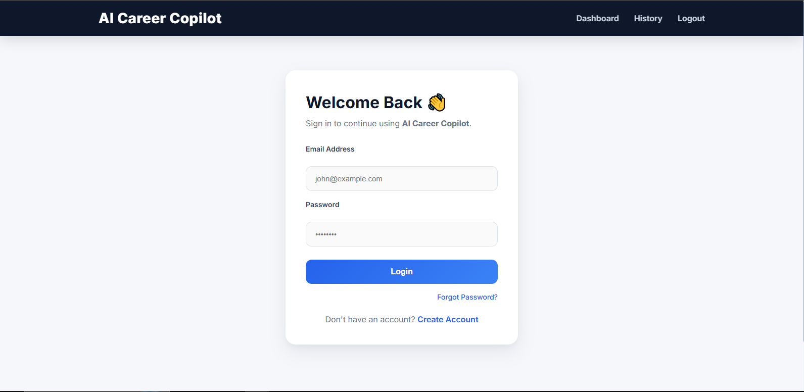
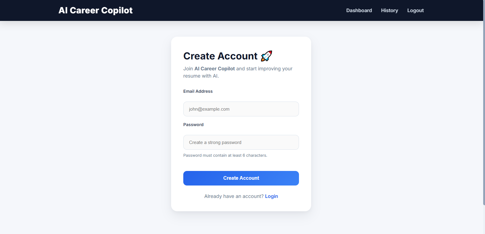
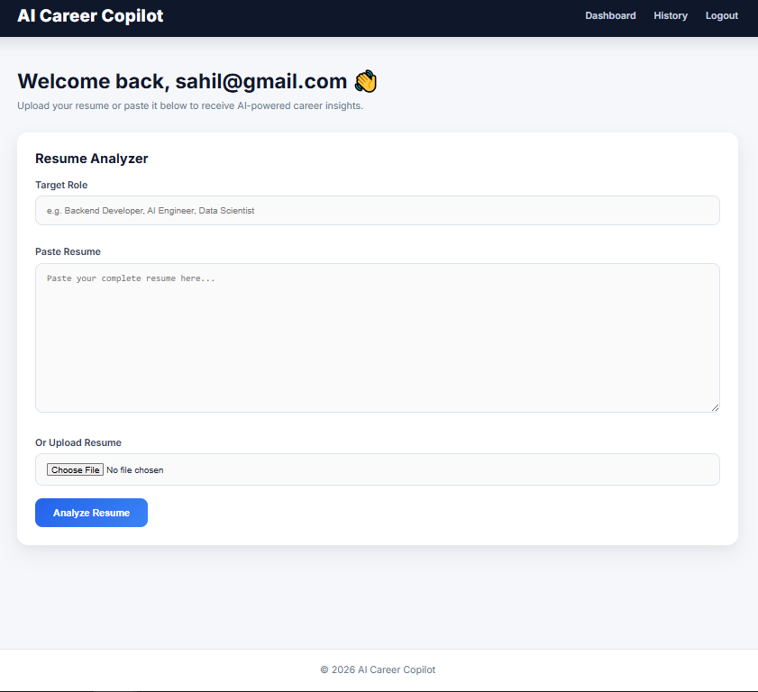

# 🚀 AI Career Copilot

AI Career Copilot is a Flask-based web application that analyzes resumes using Google's Gemini AI. Users can upload or paste their resume, specify their target role, and receive AI-powered insights including skills, missing skills, learning roadmap, and interview questions.

---

## ✨ Features

- 🔐 User Authentication (Signup & Login)
- 👤 Session Management
- 📄 Upload Resume (.pdf / .docx)
- 📝 Paste Resume Text
- 🤖 Gemini AI Integration
- 📊 Resume Skill Analysis
- 📚 Missing Skills Detection
- 🛣️ Personalized Learning Roadmap
- 💼 Interview Questions Generator
- 📜 Analysis History
- 💾 MySQL Database Storage

---

## 🛠 Tech Stack

### Backend
- Python
- Flask
- SQLAlchemy

### Database
- MySQL

### AI
- Google Gemini API

### Frontend
- HTML
- CSS
- Jinja2 Templates

### Others
- PyPDF2
- python-docx
- python-dotenv

---

## 📂 Project Structure

```
AI_Career_Copilot/
│
├── static/
│   └── style.css
│
├── templates/
│   ├── base.html
│   ├── login.html
│   ├── signup.html
│   ├── dashboard.html
│   └── history.html
│
├── app.py
├── ai.py
├── db.py
├── models.py
├── requirements.txt
├── .env.example
└── README.md
```

---

## ⚙️ Installation

Clone the repository

```bash
git clone https://github.com/YOUR_USERNAME/AI_Career_Copilot.git
```

Move into the project

```bash
cd AI_Career_Copilot
```

Create a virtual environment

```bash
python -m venv venv
```

Activate it

Windows

```bash
venv\Scripts\activate
```

Install dependencies

```bash
pip install -r requirements.txt
```

---

## 🔑 Environment Variables

Create a `.env` file using `.env.example`

```env
DB_USER=
DB_PASSWORD=
DB_HOST=
DB_PORT=
DB_NAME=

SECRET_KEY=

GEMINI_API_KEY=
```

---

## ▶️ Run

```bash
python app.py
```

Open

```
http://127.0.0.1:5000
```

---

## 📷 Screenshots

### 🔐 Login Page


---
### 📝 Signup Page


---
### 📊 Dashboard


---

## 📌 Future Improvements

- Password Hashing
- Email Verification
- Forgot Password
- User Profile
- Resume Score
- Dark Mode
- Deployment
- Docker Support
- Admin Dashboard

---

## 👨‍💻 Author

**Sahil Pandav**

GitHub:
https://github.com/sahilpandav

---